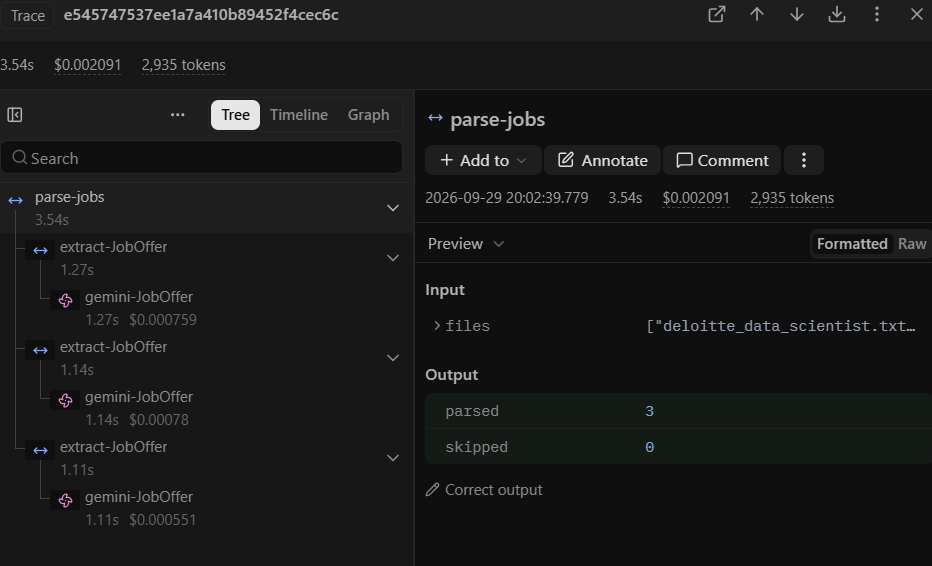
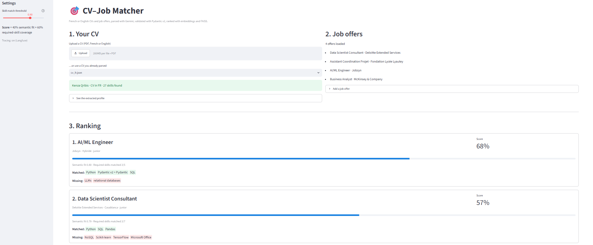

# Multilingual CV–Job Matcher

Matches CVs (French/English) to job offers using LLM extraction, Pydantic v2 validation, embeddings and Langfuse tracing.

## Status
- [x] Step 1: CV parsing → validated Pydantic v2 models (with self-correcting retry)
- [x] Step 2: Embeddings + ranking (FAISS)
- [X] Step 3: Langfuse tracing
- [ ] Step 4: Streamlit demo

## Setup
```bash
python -m venv .venv && source .venv/bin/activate   # Windows: .venv\Scripts\activate
pip install -r requirements.txt
cp .env.example .env    # then add your Gemini key
```

## Usage
```bash
python -m scripts.parse_cv data/cvs/your_cv.pdf
pytest
```
   ## Ranking jobs
```bash
   python -m scripts.parse_jobs                       # data/jobs/*.txt -> JSON
   python -m scripts.rank_jobs data/output/cv_eng.json --debug
```
   Score = 40% semantic similarity (whole CV vs whole offer, FAISS) + 60% required-skill
   coverage (each job skill matched to the closest CV skill by embedding).

## Findings
- Parsing the same CV in French and English initially gave different skill names
    ("API REST" vs "REST APIs") and French job titles. Instructing the model to
    normalize all output to English fixed most of it.
- Small variations remain ("JWT" vs "JWT Authentication"), which is why ranking
    uses embeddings rather than exact keyword matching.
- Skill matching threshold: at 0.80, embeddings matched unrelated skills
     ("TensorFlow" ~ "Apache Spark", "French" ~ "Python"). At 0.90 false matches disappear,
     but "NoSQL" ~ "SQL" (wrong) and "relational databases" ~ "SQL" (right) both score 0.90,
     so a similarity threshold alone cannot separate them.
- Embeddings are cached on disk, so each text is only sent to the API once
     (the free tier allows 100 embeddings per minute).
       
## Tracing (Langfuse)

Every LLM and embedding call is traced in Langfuse: prompt, output, tokens, latency,
validation retries (flagged as warnings) and cache hits. Tracing is optional:
without Langfuse keys in `.env`, the code runs exactly the same.

Parsing 3 job offers took 3.5 s and cost $0.0021 (about $0.0007 per offer).



   ## Demo
```bash
   streamlit run app.py
```
   Upload a CV (PDF, French or English) or pick one already parsed, and see the offers
   ranked with matched and missing skills. The threshold can be adjusted in the sidebar.

   

   The French CV gives the same Jobzyn score (68%) as the English one: normalization to English
   makes the matching language-independent.